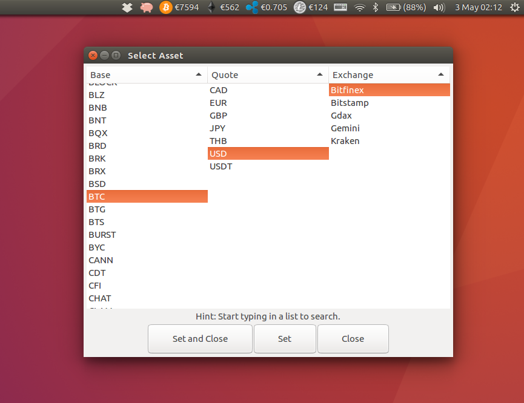

# Coindicator


Coindicator is a cryptocurrency price indicator applet for Linux.

[](https://badge.fury.io/py/coindicator)

## Features

* Multiple price tickers in the status bar
* Automatic trade pair discovery on supported exchanges
* Additional price points in the dropdown menu
* Audiovisual price alerts
* Adjust the refresh rate
* Thousands of cryptocurrency pairs from the following exchanges:

	* [Kraken](https://www.kraken.com)
	* [Bitstamp](https://www.bitstamp.net)
	* [Gemini](https://www.gemini.com)
	* [Binance](https://www.binance.com)
	* [Bittrex](https://bittrex.com)
	* [Bitfinex](https://www.bitfinex.com/)
	* [Poloniex](https://poloniex.com)
	* [HitBTC](https://hitbtc.com/)
	* [CEX.io](https://cex.io/)
	* [OKCoin](https://www.okcoin.cn/)
	* [Unocoin](https://www.unocoin.com/)
	* Add your own easily (See **Extending (Plugins)** below)



## Installing

You will need Git and Python 3.5 or higher, as well as some system dependencies.

For your convenience, I've included a small install script that will install (or upgrade)
coindicator and its dependencies, as well as create a desktop icon.

```bash
 git clone https://github.com/bluppfisk/coindicator.git
 cd coindicator
 ./install.sh
```

## Upgrading from 1.x

User data has moved to your home folder. To keep your settings, move the user.conf file to: **~/.config/coindicator/**.

## Running

* A launcher icon "Coindicator" should be installed that can be used to start the app
* Alternatively, run `./run.sh` to activate the virtual environment and start the app
* You can also run the program manually with `source env/bin/activate` and then run `src/coin/coin.py &` or `python3 src/coin/coin.py &` to start the app

## Configuring

Use the GUI to add and remove indicators (find the piggy icon), to pick assets, to set refresh frequency and to set alarms. Alternatively, edit the **user.conf** YAML file in the project root.

`max_decimals`: default 8. Lower if you want fewer decimals (takes priority over `significant_digits`)
`significant_digits`: default 3. Set to higher if you want more significant digits.

## Extending (Plug-ins)

Adding your own exchange plug-in is easy. Just create class file with methods for returning a ticker URL, a discovery URL, and parsing the responses from the ticker and discovery APIs. Then add the file to the `exchanges` folder.

Have a peek at the existing plug-ins (e.g. **kraken.py**) for an example and don't forget to contribute your plug-ins here on GitHub!

## Troubleshooting

This software was tested and found working on the following configurations:
* Ubuntu Linux 16.04 (Xenial Xurus) with Unity 7
* Ubuntu Linux 17.10 (Artful Aardvark) with GNOME 3 and Unity 7
* Ubuntu Linux 18.04 (Bionic Beaver) with GNOME 3 and Unity 7
* Ubuntu Linux 19.04 (Disco Dingo) with GNOME 3 and Unity 7
* Ubuntu Linux 19.10 (Eoan Ermine) with GNOME 3 and Unity 7
* Ubuntu Linux 20.04 (Focal Fossa) with GNOME 3
* Ubuntu Linux 20.10 (Groovy Gorilla) with GNOME 3
* Ubuntu Linux 21.04 (Hirsute Hippo) with GNOME 3
* Ubuntu Linux 21.10 (Impish Indri) with GNOME 3
* Ubuntu Linux 22.04 (Jammy Jellyfish) with GNOME 3
* Ubuntu Linux 22.10 (Kinetic Kudu) with GNOME 3

For other systems, you may need to install LibAppIndicator support.

Before reporting bugs or issues, please try removing **~/.config/coindicator/user.conf** first and then the files in **~/.config/coindicator/cache/**.

## Sponsorship and Funding


This project has been funded in the past by generous maecenas @ghettodev through [Gitcoin](https://gitcoin.co/), a platform that directs the attention of bounty hunters (coders) to open issues and feature requests on Github.

If you would like to sponsor a feature request, bug report or just donate to the project, be sure to check out [Gitcoin](https://gitcoin.co/).
